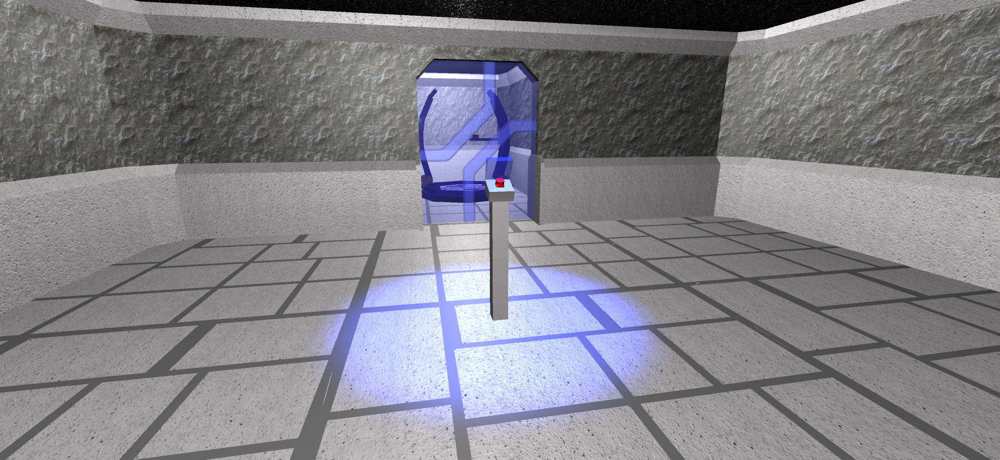
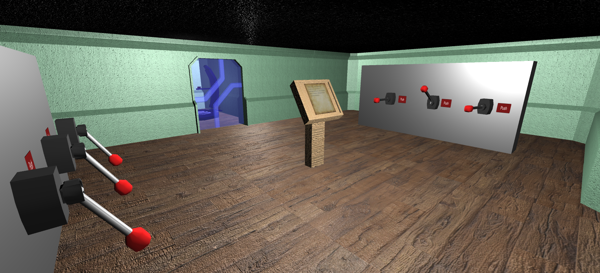

# MiniQuiz

Проект представляет собой мини-головоломку, состоит из трёх уровней. Предназначен для запуска на ПК.

---

# Images

---

# Tech
* C#
* 3D modeling
* Unity 3D
---
# Developers
* Баканова М.В.
* Новаков Н.Ю.
---

